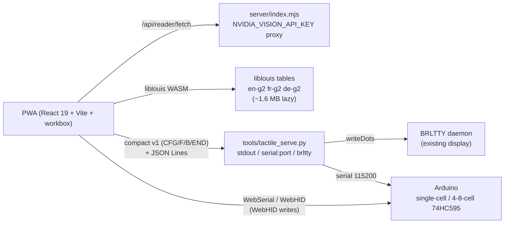

# Architecture — isVisible

> PWA is the product; `tactile_serve` + firmware are prototype. **BRLTTY is a relay, not a driver** — `docs/hardware-honesty.md`. Preserve routes, APIs, and folder structure — additive only.

## System map



## PWA shell (`pwa/`)

- **Entry:** `pwa/src/main.tsx` → `App.tsx:22-29` 8 lazy routes (`/`, `/settings`, `/onboarding`, `/troubleshoot`, `/touch-explorer`, `/ai-vision`, `/reader`, `/voice-nav`, `/tactile-output`, `/tactile-drill`, `/tactile-graphics`, `/hardware-emulator`) behind `Suspense` + `ErrorBoundary` + `RequireOnboarding`.
- **State:** `zustand` + `persist` — `isvisible-settings` (`settingsStore.ts`), `isvisible-tactile` (`tactileStore.ts` + `last-100` drill history), `isvisible.reader.pos:<url>` in `sessionStorage` (`useReader.ts:17-38`), `useSettingsStore.lastSession` resume (`HomePage.tsx:240-261`).
- **A11y:** `AriaLive.tsx`, `SkipLinks.tsx`, `FocusTrap.tsx`, `useRouteAnnounce.ts:46-52`, `Button.tsx` 44 px, `index.css:119-128` reduced-motion.
- **Build:** `pwa/package.json:16-24` `prebuild → check-env + copy-liblouis`, `build → tsc -b && vite-build.mjs`, `verify → build && test && test:a11y`. Deploy `wrangler.jsonc` assets at `pwa/dist` via Cloudflare Workers.

## Data flows

| Flow | Path | Files |
|---|---|---|
| URL → speech | `fetchArticleHtml` → `cleanContent` (DOMPurify) → `splitIntoChunks` → `speechEngine.speak` | `useReader.ts:86-138`, `contentCleaner.ts`, `SpeechEngine.ts` |
| Text → braille frames | `liblouisAdapter.ts` (lazy WASM) → `brailleFrames.ts` → `HardwareEmulatorPage` preview + compact export | `tactile-output/*`, `graphicsConverter.ts` |
| Camera → description → Reader/Tactile | `useVisionAssistant.ts` `idle→capturing→analyzing→speaking` → `NvidiaClient.ts` → server proxy | `ai-vision/*`, `server/index.mjs` |
| Voice → action | `useGlobalVoiceHotkey` (F6) → `commandRegistry` → `voiceActions` `MODULE_VOICE_ACTION_EVENT` | `voice-nav/*`, `SpeechRecognition.ts` |
| Frames → OS | PWA `inputAdapters` → `tactile_serve dispatch()` → `StdoutSink`/`SerialSink`/`BrlttySink:writeDots` | `src/isvisible/protocol.py`, `tools/tactile_serve.py:160-218` |

## Protocol (compact v1)

Grammar in `src/isvisible/protocol.py` + `docs/tactile-protocol.md`: `CFG hold_ms=… blank=…`, `F <index> <cell_start> <masks…>` (0–255, bits 1–8), `B` (blank), `END`, `IN` (braille keyboard input). See `API.md` for serialization details.

## Firmware

- `firmware/single-cell-arduino/` — Phase 2, 6-dot cell (pins 2–7), compact consumer.
- `firmware/cell-strip-arduino/` — Phase 3, 4–8 cells on 74HC595 + nav buttons + braille keyboard reporting `IN` lines. Safety constraints in `docs/user-problem-brief.md:51-57` (0.5–0.7 mm, <0.3 N, 2.5 mm, <50 ms, <41 °C, <45 dBA).

## Folder map

```
pwa/src/{core/{a11y,audio,hooks,store,utils},components,pages,modules/{touch-explorer,ai-vision,reader,voice-nav,tactile-output,tactile-graphics}}
src/isvisible/protocol.py
tools/{tactile_serve.py,braille_stream.py}
firmware/{single-cell-arduino,cell-strip-arduino}
docs/{roadmap,prototype-architecture,research-notes,tactile-protocol,hardware-honesty,research/}
```

See `DESIGN_SYSTEM.md`, `API.md`, `HARDWARE.md` for the next layer.
