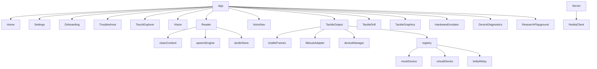

# Module Graph — isVisible

```mermaid
graph TD
  App --> Home & Settings & Onboarding & Troubleshoot
  App --> TouchExplorer & Vision & Reader & VoiceNav & TactileOutput & TactileDrill & TactileGraphics & HardwareEmulator & DeviceDiagnostics & ResearchPlayground
  Reader --> cleanContent & speechEngine & tactileStore
  TactileOutput --> brailleFrames & liblouisAdapter & deviceManager & registry
  registry --> mockDevice & virtualDevice & brlttyRelay
  Server --> NvidiaClient
```

Source: `pwa/src/App.tsx:22-30` lazy routes. Generated from `ARCHITECTURE.md`.
